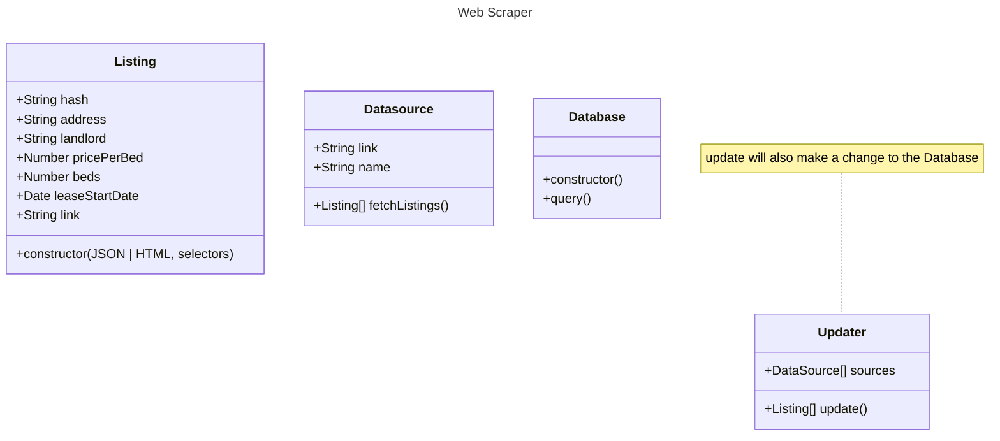

# QUHouseFinder Web Scraper

## Currently implemented sources

- Frontenac
- Limetsone
- Axon
- Panadew
- Heron Management
- Facebook
- Ebay
- Queen's Community Housing

## Design plan

## TODO

- Make nullable columns in the database not "not null"